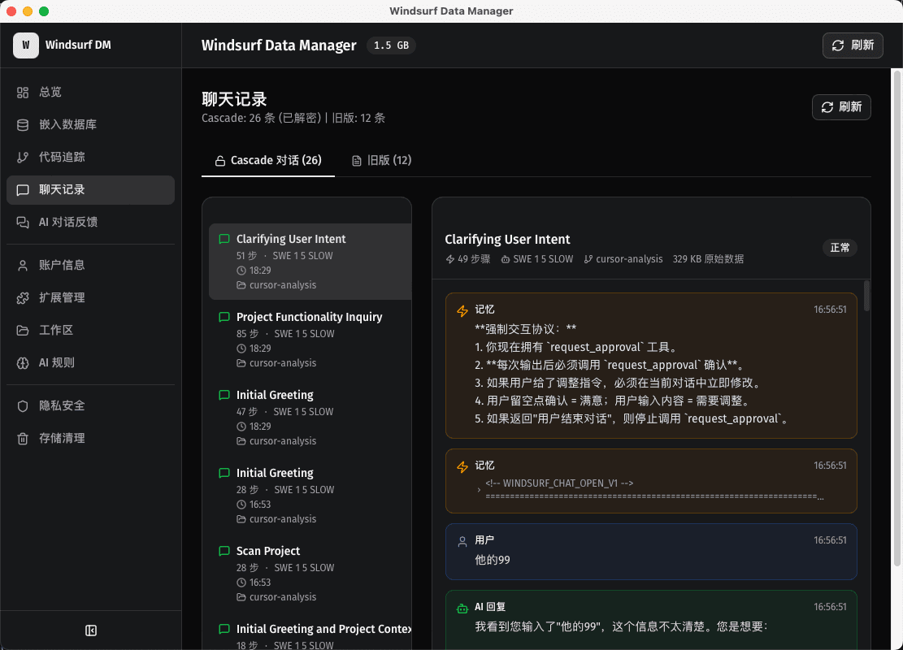
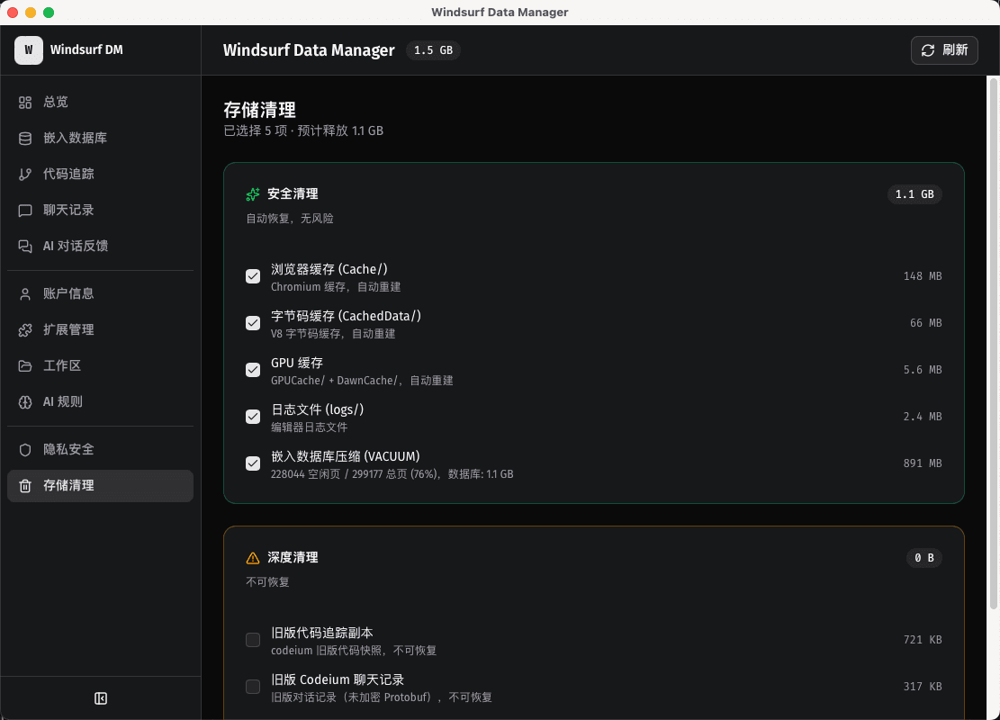
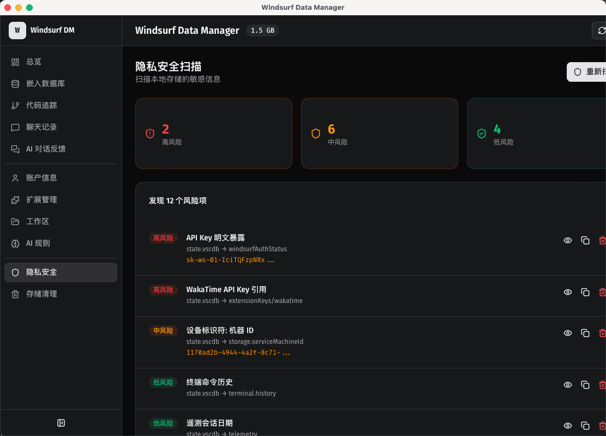
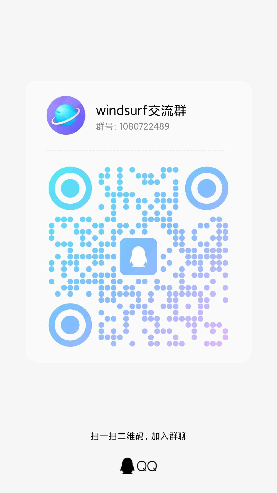

# Windsurf Data Manager

<p align="center">
  <a href="https://github.com/congwa/wdm">
    
  </a>
  <a href="https://gitee.com/cong_wa/wdm">
    
  </a>
  <a href="https://github.com/congwa/wdm/releases/tag/v0.3.0">
    
  </a>
</p>

## 🏠 仓库地址

- **🔗 GitHub**: https://github.com/congwa/wdm
- **🔗 Gitee**: https://gitee.com/cong_wa/wdm

---

一款专为 Windsurf AI 开发环境打造的智能数据管理工具，提供 **智能存储清理** 和 **全面数据分析** 功能。

## 🎯 核心功能

### 💬 AI 对话统计


**精准控制 AI 对话流程，获得更好的编程体验**

- **实时监控**: 显示 Token 使用量、模型信息和对话状态
- **上下文分析**: 提供详细的上下文信息和使用统计

<p align="center">
  
</p>

**主要特性：**
- 📊 Token 使用量实时监控，避免超限
- 🏷️ 智能标签管理，快速识别对话类型
- 🎛️ 精细化控制选项，自定义 AI 行为
- 💾 对话历史保存，方便回顾和分析

### 🧹 智能存储清理

<p align="center">
  
</p>

**安全高效的存储空间管理解决方案**

- **安全清理**: 自动识别可安全删除的临时文件、缓存等
- **深度清理**: 高级清理选项，释放更多存储空间（需确认）
- **智能分析**: 自动扫描和分类不同类型的文件
- **预估计算**: 显示预计释放空间大小

**清理类别：**
- 📦 构建产物 (dist, build, target 等)
- 🗃️ 依赖缓存 (node_modules, .cargo 等)
- 📝 日志文件 (*.log, crash reports 等)
- 🔧 临时文件 (*.tmp, *.temp 等)
- 🖥️ 系统文件 (.DS_Store, Thumbs.db 等)

### 📊 数据分析与管理

<p align="center">
  
</p>

**全面的项目数据洞察和管理功能**

- **仪表盘概览**: 项目关键指标一目了然
- **使用统计**: AI 对话频率、Token 消耗趋势
- **项目分析**: 代码结构、文件类型分布
- **历史追踪**: 长期使用模式和趋势分析

## 🚀 快速开始

### 📦 下载安装

#### 最新版本 v0.3.0

| 平台 | GitHub | Gitee |
|------|--------|-------|
| **macOS (Apple Silicon)** | [下载 DMG](https://github.com/congwa/wdm/releases/download/v0.3.0/Windsurf.Data.Manager_0.3.0_aarch64.dmg) | [下载 DMG](https://gitee.com/cong_wa/wdm/releases/v0.3.0) |
| **macOS (Intel)** | [下载 DMG](https://github.com/congwa/wdm/releases/download/v0.3.0/Windsurf.Data.Manager_0.3.0_x64.dmg) | [下载 DMG](https://gitee.com/cong_wa/wdm/releases/v0.3.0) |

#### 安装步骤

**macOS:**
1. 下载对应架构的 DMG 文件
2. 双击打开安装包
3. 将应用拖拽到 Applications 文件夹
4. 首次运行需要在「系统设置」→「隐私与安全性」中允许运行

### 环境要求

- **Node.js** >= 18.0.0
- **Rust** >= 1.70.0
- **Tauri CLI** >= 2.0.0

### 安装步骤

1. **克隆项目**
   ```bash
   git clone https://github.com/congwa/wdm.git
   cd wdm
   ```

2. **安装依赖**
   ```bash
   npm install
   ```

3. **开发模式运行**
   ```bash
   npm run tauri:dev
   ```

4. **构建应用**
   ```bash
   npm run tauri:build
   ```

## 🛠️ 技术栈

### 前端技术
- **React** 19+ - 现代化 UI 框架
- **TypeScript** - 类型安全开发
- **Tailwind CSS** - 快速样式开发
- **Vite** - 高性能构建工具
- **Lucide React** - 优雅图标库
- **Zustand** - 轻量状态管理
- **React Router** - 路由管理

### 后端技术
- **Tauri** - 跨平台桌面应用框架
- **Rust** - 高性能系统编程语言
- **serde** - 序列化/反序列化
- **tokio** - 异步运行时

### 开发工具
- **ESLint** - 代码质量检查
- **Prettier** - 代码格式化
- **TypeScript Compiler** - 类型检查

## 📁 项目结构

```
windsurf-data-manager/
├── src/                    # React 前端源码
│   ├── components/        # 可复用组件
│   │   ├── ui/           # 基础 UI 组件
│   │   └── layout/       # 布局组件
│   ├── pages/            # 页面组件
│   │   ├── chat-history/  # AI 对话历史
│   │   ├── cleanup/      # 存储清理
│   │   ├── dashboard/    # 数据分析仪表盘
│   │   └── ...
│   ├── stores/           # 状态管理
│   ├── lib/             # 工具函数
│   └── types/           # 类型定义
├── src-tauri/             # Tauri 后端源码
│   ├── src/              # Rust 源码
│   ├── Cargo.toml        # Rust 依赖配置
│   └── tauri.conf.json   # Tauri 配置
├── public/               # 静态资源
└── dist/                 # 构建输出
```

## 🎨 设计系统

项目采用现代化的设计语言，遵循以下设计原则：

- **简洁优雅**: 清晰的视觉层次和简洁的交互
- **响应式设计**: 适配不同屏幕尺寸
- **深色主题**: 护眼的深色界面设计
- **无障碍访问**: 符合 WCAG 标准的可访问性
- **性能优化**: 流畅的动画和快速响应

## 🔧 配置说明

### 环境变量
创建 `.env` 文件配置应用参数：

```env
# API 配置
VITE_API_BASE_URL=http://localhost:3000
VITE_WS_URL=ws://localhost:3001

# 功能开关
VITE_ENABLE_DEBUG=false
VITE_ENABLE_ANALYTICS=true
```

### Tauri 配置
修改 `src-tauri/tauri.conf.json` 自定义应用行为：

```json
{
  "package": {
    "productName": "Windsurf Data Manager",
    "version": "0.3.0"
  },
  "tauri": {
    "allowlist": {
      "all": false,
      "fs": {
        "all": true
      },
      "dialog": {
        "all": true
      }
    }
  }
}
```

## 📝 使用指南


### 存储清理功能

1. **扫描文件**: 自动扫描项目中的冗余文件
2. **查看分类**: 查看安全清理和深度清理选项
3. **选择项目**: 勾选需要清理的文件类别
4. **执行清理**: 点击对应的清理按钮执行操作
5. **查看结果**: 在结果对话框中确认清理效果

## 🔗 相关链接

- [Tauri 官方文档](https://tauri.app/)
- [React 官方文档](https://reactjs.org/)
- [Tailwind CSS 文档](https://tailwindcss.com/)
- [TypeScript 文档](https://www.typescriptlang.org/)

## 📄 许可证

本项目采用 MIT 许可证 - 查看 [LICENSE](LICENSE) 文件了解详情。

## 🤝 贡献指南

欢迎贡献代码！请查看 [CONTRIBUTING.md](CONTRIBUTING.md) 了解详细的贡献流程。

### 开发流程

1. Fork 本仓库
2. 创建功能分支 (`git checkout -b feature/AmazingFeature`)
3. 提交更改 (`git commit -m 'Add some AmazingFeature'`)
4. 推送到分支 (`git push origin feature/AmazingFeature`)
5. 开启 Pull Request

## 🐛 问题反馈

遇到问题？请通过以下方式反馈：

- [GitHub Issues](https://github.com/congwa/wdm/issues)
- [讨论区](https://github.com/congwa/wdm/discussions)

## 🙏 致谢

感谢所有为这个项目做出贡献的开发者和用户。

---

<p align="center">
  ⭐ 如果这个项目对你有帮助，请给个 Star 支持一下！
</p>

---

<p align="center">
  
</p>
